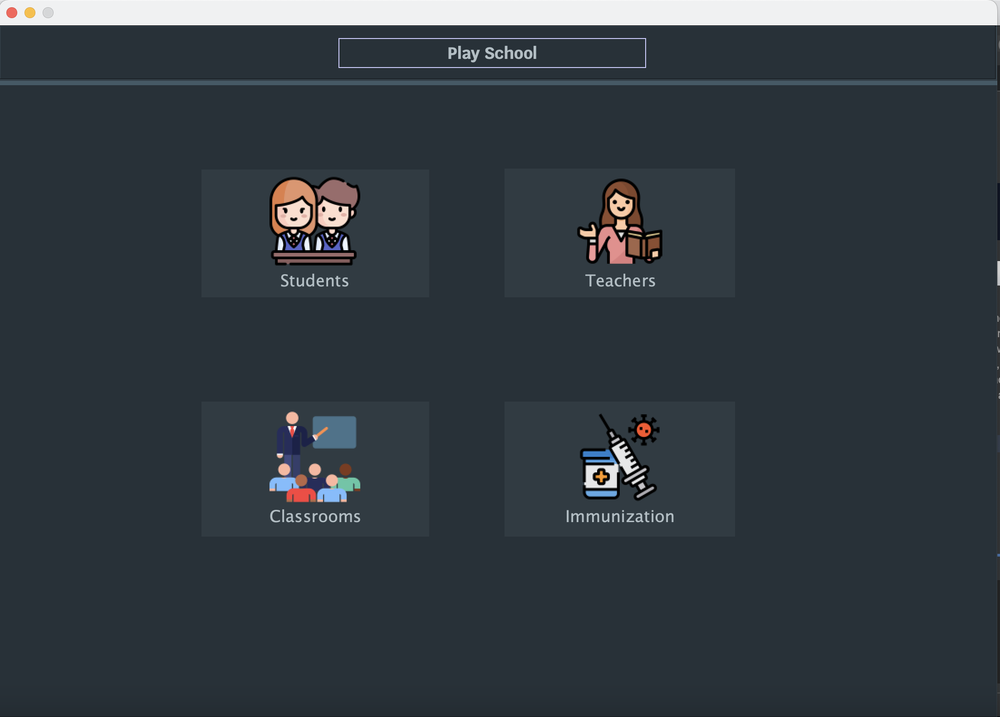
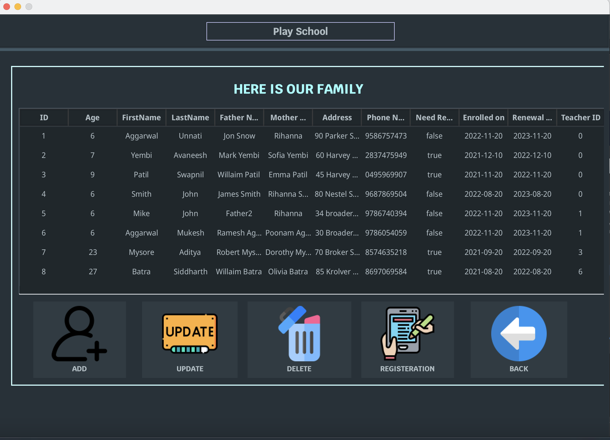
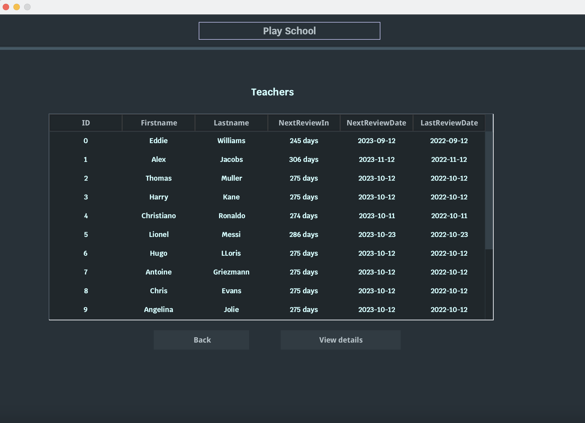
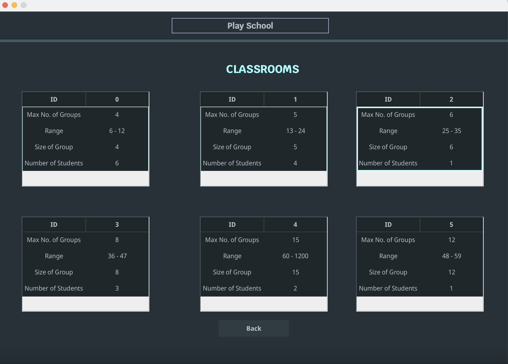
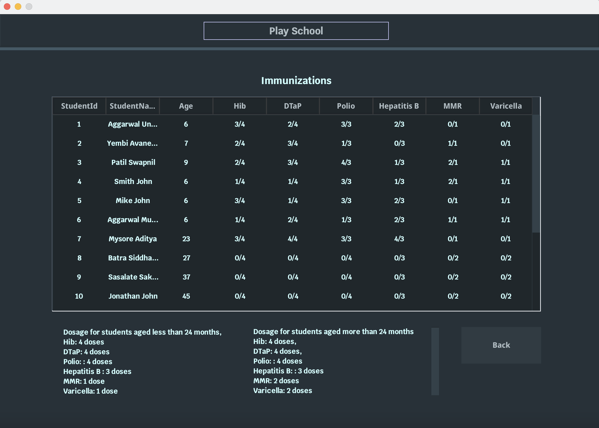

Welcome to Daycare - Student Registration and Management System
This is a comprehensive solution to manage student registration, immunization records and compliance with state regulations for daycare center. Our system allows you to easily enroll students, track annual registration renewal and immunization anniversaries, and assign students and teachers to groups and classrooms. We have built this project using Java Swing for creating the user-friendly GUI.

Enroll Students
Our system allows you to easily capture student information, including:

Student name and age
Parent's name, address and phone number
Input can be done via user-friendly GUI built using Java Swing and CSV file upload
Track Annual Registration Renewal
Our system allows you to easily keep track of annual student registration renewal, making sure that your records are always up to date and accurate.

Track Immunization Anniversaries
Our system allows you to easily track student immunization anniversaries by importing records from CSV files, ensuring compliance with state regulations.

Assign Students to Teachers
Our system allows you to assign students to teachers according to state regulations, making sure that your daycare center is always in compliance.

Assign Student/Teacher Groups to Classrooms
Our system allows you to easily assign student and teacher groups to classrooms according to state regulations, making sure that your daycare center is always in compliance.

Track Annual Employee Review
Our system allows you to easily track annual employee review, allowing you to manage your staff and maintain the best possible working environment.

We hope that you find our Daycare Student Registration and Management System to be a valuable tool in managing your daycare center student registration and compliance with state regulations.

